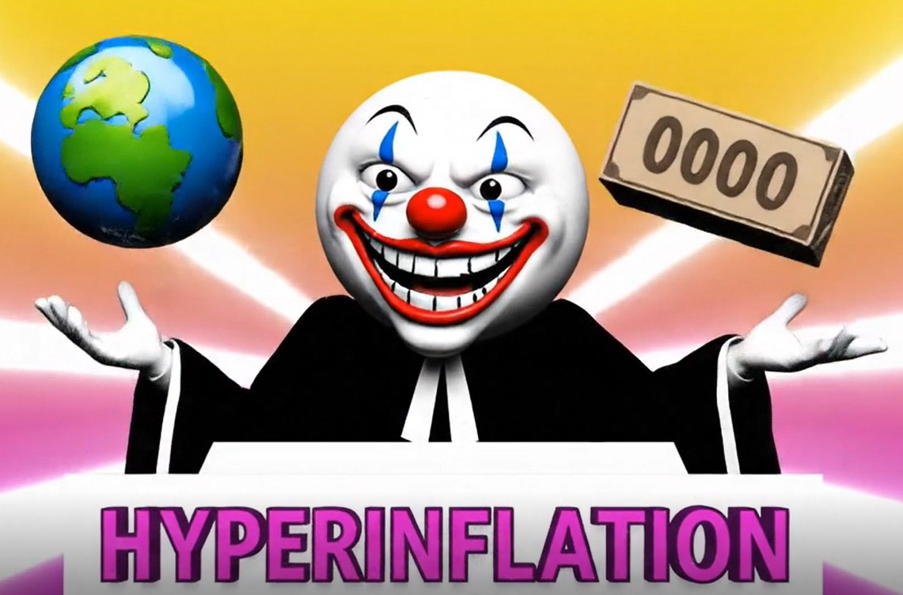
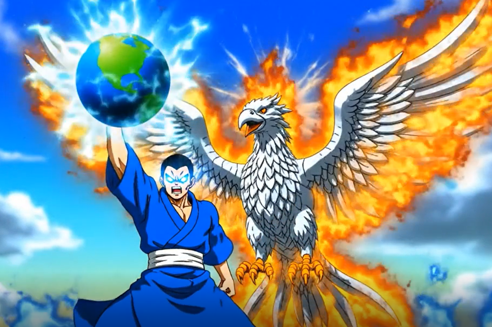

# Battle Platform for X1

The Battle Platform for X1 is a lightweight game project to:

1. Demonstrate the benefits of network effects for the X1 Blockchain in a fun, gamified way.
2. Introduce new devs to properties of massive simulated battles, and the game theory for strategy games on X1.

It is a battle simulator to run future scenarios where the _entire X1 community_ fights against a terrifying final boss monster: **_HYPERINFLATION, the JUGGLING TYRANT._** He is a clown who juggles the entire world in one hand and a brick of worthless paper money in the other hand. He cruelly taunts and humiliates _entire populations_ for his own twisted entertainment. As long as he is standing, people around the world live in a _clown show_. HYPERINFLATION is partially responsible for the evils of past economic inflation, like the wheelbarrows of worthless paper money in the Weimar Republic (Germany, 1923).

HYPERINFLATION also represents something far larger, something that's hidden and even sinister: he is a symbol for the systematic destruction of value through high quantity, but terrible quality. These days, far too many posers and crying boys try to rule over genuine builders. Far too many firms ship broken products that suffer from shrinkflation. The X1 community is engaged in a fight against _mediocrity itself_.

The X1 Battle platform uses precise mathematical laws of network scaling and military tactics to calculate scenarios where X1 can grow so large, it can even challenge HYPERINFLATION itself, to save the entire world from his wrath.

# Power Levels

The Battle Platform for X1 uses quadratic power scaling. This means that power is proportional not to quantity, but to _quantity squared_. This creates a _strong parallel_ between the quadratic scaling of [Metcalfe's Law](https://en.wikipedia.org/wiki/Metcalfe's_law) and [Lanchester's Square Law](https://en.wikipedia.org/wiki/Lanchester's_laws), to create a _Metcalfe-Lanchester power score_.

**Metcalfe's Law:** $Network \\, Power = Quality \cdot (Quantity \\, of \\, Nodes)^2$

**Lanchester's Law:** $Army \\, Power = Quality \cdot (Quantity \\, of \\, Units)^2$

This is a semi-realistic treatment of combat with an equation (Lanchester's Square Law) used by experts to simulate _actual military battles_, such as the [WWII Battle of Britain (1940)](https://www.jstor.org/stable/24429278). Therefore, virtual combat can be a surprisingly intuitive way to visualize the power of quadratic network effects from additional users. However, notice that if the quality is zero, then the power is also zero. Quality matters.

If you play strategy games, you have likely come up against Lanchester's Square Law over and over again, _without even realizing it_. The best example is Starcraft. In Starcraft, a major emergent meta is that huge concentrated armies (like "Zerg Swarms", "Skytoss Deathballs", or "Skyterran Deathballs") are so powerful as a combined group that they can instantly destroy smaller armies. If you played Starcraft, you likely wondered, "_Why did that happen? How is something like that even possible_?"

It's because Lanchester's Square Law was operating in the background as an _emergent property_, giving those armies a very high combat effectiveness through quadratic scaling, even though it was never explicitly coded into the game.

# Battle Simulation: Loss

HYPERINFLATION has an insanely high score: _1 quadrillion_ (1,000,000,000,000,000, or $10^{15}$)! How is it even possible to stand against him? The answer is through quadratic power scaling.

Suppose that X1 has 10 million users, with a quality of 8.88888888 for each person:

`win, result_text = battle_simulator(10_000_000, 8.88888888)`

The outcome:

`The size of the X1 Network community is 10,000,000.
Each person's quality is 8.88888888.
The X1 community is fighting against HYPERINFLATION!
He has a score of 1,000,000,000,000,000!
The Warriors (Validators) are burning XNT.
The Rogues (Xenians) are burning Xen.
The Mages (Alchemists) are burning Platinum.
The community's quadratic Metcalfe-Lanchester power level:
888,888,888,000,000.0.
Defeat! The HYPERINFLATION remains standing.
Fighters only reached 888,888,888,000,000.0 power.
Billions of people are living in a clown show.`

# Battle Simulation: Win

But what if X1 had 15 million users instead?

`win, result_text = battle_simulator(15_000_000, 8.88888888)`

The outcome:

`The size of the X1 Network community is 15,000,000.
Each person's quality is 8.88888888.
The X1 community is fighting against HYPERINFLATION!
He has a score of 1,000,000,000,000,000!
The Warriors (Validators) are burning XNT.
The Rogues (Xenians) are burning Xen.
The Mages (Alchemists) are burning Platinum.
The community's quadratic Metcalfe-Lanchester power level:
1,999,999,998,000,000.0.
Victory! The fighters amassed 1,999,999,998,000,000.0 power.
They slammed HYPERINFLATION.
X1 has saved the entire world, with help from the Alchemists.`

How did the X1 community gain a score of virtually _two quadrillion_? The answer is because its _Network Power_ was proportional to its already high number of users (15 million) _squared_, creating absolutely astronomical scores. This made the X1 community powerful enough to even defeat HYPERINFLATION in simulated combat.

Lanchester's Laws _greatly simplify_ combat simulation for massive battles involving millions or even _billions of participants_, without having to simulate each agent's combat individually. This allows instant combat resolution, even in a very large multiplayer match for an onchain strategy game. Extensions of Lanchester's equations can even simulate the remaining army forces from massive battles, not just the win or loss itself.

# Possible Extensions

The Battle Platform for X1 is still in _extremely early_ development. The combat logic itself is elegant and simple, but right now it only features arbitrary parameters, and one battle.

Possible Extensions:

1. The battle simulator could later be populated with realistic numbers by querying the X1 Blockchain metrics for users and AI agents. A measure of "Quality" can be calculated from onchain burn statistics of multiple tokens, including XNT, Xen, and/or Platinum.
2. Extended Game Campaign consisting of multiple engagements, including a combination of both minor Skirmishes against minibosses, as well as major Battles. Finally, this could culminate in X1's dramatic victory over HYPERINFLATION himself.
3. Frontend web or mobile interface that displays live global power levels of the X1 community as a unified group, and multiple combat results against HYPERINFLATION within the Campaign.
